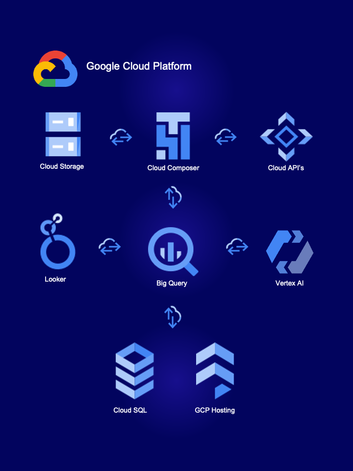

    

# Proyecto de Data Science: HotelWise <!-- omit in toc -->

## Indice <!-- omit in toc --> 

- [**Introducción**](#introducción)
- [**Entendiendo la situación propuesta**](#entendiendo-la-situación-propuesta)
  - [¿Qué nos diferencia de las demás plataformas?](#qué-nos-diferencia-de-las-demás-plataformas)
- [**Objetivo Principal**](#objetivo-principal)
  - [**Objetivos Específicos**](#objetivos-específicos)
    - [**KPI's plataforma**](#kpis-plataforma)
    - [**KPI's Usuario**](#kpis-usuario)
    - [**Stack Tecnológico**](#stack-tecnológico)
  - [**Alcance del proyecto**](#alcance-del-proyecto)
  - [**Metodología de trabajo**](#metodología-de-trabajo)
    - [**Sprint 1** del 29 de enero al 09 febrero 2024](#sprint-1-del-29-de-enero-al-09-febrero-2024)
    - [**Sprint 2** del 12 al 23 de febrero 2024](#sprint-2-del-12-al-23-de-febrero-2024)
    - [**Sprint 3** 26 de febrero al 09 de marzo 2024](#sprint-3-26-de-febrero-al-09-de-marzo-2024)
  - [**Roles y responsabilidades**](#roles-y-responsabilidades)
    - [Data Engineers](#data-engineers)
    - [Data Analists](#data-analists)
    - [Data Scientist \& Web Master](#data-scientist--web-master)
  - [**Diagrama Gantt** con ClickUp](#diagrama-gantt-con-clickup)
    - [Sprint 1](#sprint-1)
    - [Sprint 2](#sprint-2)
    - [Sprint 3](#sprint-3)
- [Ramas del Proyecto](#ramas-del-proyecto)
  - [HotelWiseETL](#hotelwiseetl)
  - [HotelWiseEDA](#hotelwiseeda)
  - [HotelWise\_DA](#hotelwise_da)
  - [HotelWiseWeb](#hotelwiseweb)
  - [HotelWiseML](#hotelwiseml)
- [Contribución](#contribución)
- [Créditos](#créditos)
- [Licencias](#licencias)
- [Contacto](#contacto)
- [Enlaces adicionales](#enlaces-adicionales)

---

#  **Introducción**

Nuestro servicio 'HotelWise', es un servicio de recomendacion de hoteles que se destaca por brindar una experiencia de usuario excepcional y de primer nivel, superando la mera comparación de opciones de alojamiento. A diferencia de plataformas similares, nos especializamos en ofrecer una cuidadosa selección de hoteles de alta calidad, respaldados por reseñas auténticas y detalladas. Además, contamos con información confiable sobre zonas seguras para garantizar la tranquilidad de nuestros usuarios.

---

# **Entendiendo la situación propuesta**

En un mercado saturado de plataformas de reservas de hoteles, HotelWise se destaca como un oasis de calidad y confiabilidad. No nos conformamos con ofrecer una simple comparación de opciones de alojamiento; nuestra misión es proporcionar una experiencia de usuario excepcional y de primer nivel que va más allá de las expectativas tradicionales.

## ¿Qué nos diferencia de las demás plataformas?

Selección Cuidadosa de Hoteles: En HotelWise, nos enorgullece ofrecer una cuidadosa selección de hoteles de alta calidad. No se trata solo de proporcionar opciones; se trata de garantizar que cada hotel en nuestra plataforma cumplirá a cabalidad las expectativas del usuario.

Reseñas Auténticas y Detalladas: Entendemos la importancia de la transparencia y la confianza en la industria hotelera. Por eso, cada reseña en HotelWise es auténtica y detallada, proporcionada por viajeros reales que han experimentado de primera mano lo que cada hotel tiene para ofrecer. Creemos en la honestidad y la integridad en cada
paso del camino.

Información Confiable sobre Zonas Seguras: La seguridad de nuestros usuarios es una prioridad absoluta. Por eso, ayudaremos a encontrar el hotel perfecto, sino que también te proporcionamos información confiable sobre las zonas seguras de cada
destino. Queremos que nuestros usuarios viajen con tranquilidad y confianza, sabiendo que están en buenas manos.

En HotelWise, no solo estamos en el negocio de ofrecer habitaciones de hotel; estamos en el negocio de crear recuerdos inolvidables y experiencias de viaje extraordinarias. Si
estás buscando invertir en una plataforma que se enorgullece de su compromiso con la calidad, la transparencia y la satisfacción del cliente, HotelWise es la elección perfecta.

---

# **Objetivo Principal**

Presentar una plataforma web que realice recomendaciones de hoteles, mediante machine learning utilizando las comodidades y zona geografica preferidas por el usuario, donde el tiempo de muestra de la recomendación sea menor a 30 segundos, utilizando herramientas en la nube con un tiempo de implementación no mayor a 6 semanas.

## **Objetivos Específicos**

Crear dos bases de datos una para filtrar las zonas utilizando Cloud SQL y para el modelo de machine learning con Vertex AI.

Crear Analisis de datos con looker para medir rendimiento de la plataforma y mostrar indicadores clave para convencer al usuario de la recomendación del hotel

Crear un modelo de recomendación utilizando Tensorflow para la generación de valor obtenido de los datos al usuario

Crear una plataforma web intuitiva y eficiente al momento de realizar recomendaciones al usuario.

### **KPI's plataforma**
---

Tiempo de obtención de datos de Cloud SQL

Tiempo de obtención de datos de Cloud Storage

Tiempo de proceso de ML

### **KPI's Usuario**
---

Porcentaje de similitud de amenidades del hotel con relacion a las amenidades preferidas del usuario

Distancia del punto o zona de interes del usuario

Porcentaje de reseñas positivas sobre las amenidades del hotel

Indice de seguridad de la zona del hotel

demanda por meses o epoca

### **Stack Tecnológico**
---

    

---

## **Alcance del proyecto**

El proyecto parte con la base de datos ubicada en el pais de Estados Unidos, abarcara  de 51 Estados, donde se sentrará la atención principalmente en el rendimiento del tiempo de retorno de información y el valor otorgado por la analitica para el convencimiento del Usuario al momento de la elección del Hotel recomendado.

La ejecución de este constará de 6 semanas donde se utilizaran sprints para la divición de tareas a realizar y metas a cumplir, donde en el primer sprint semana 1 y 2 se definen los objetivos, metodologias, tecnologias, tareas y roles. La Semana 3 y 4 se realizará la extracción, disposición y analisis de datos; y por ultimo la semana 5 y 6 el desarrollo del sistema de recomendación mediante machine learning. En paralelo a las semanas 3, 4, 5 y 6 se llevara a cabo el diseño y pespliegue de la web.

El mismo será escalable gracias a que se implementará un flujo de extraccion y disposición de datos automatizado, por lo que permitirá en un futuro ir agregando paises junto con su divición política.

---

## **Metodología de trabajo**

El proyecto se divide en 3 etapas denominadas Sprints, cada sprint constará de 2 semanas, donde en cada una tendrá 3 reuniones mediante google meet, en esta los miembros del equipo harán reporte sobre el trabajo realizado, los inconvenientes y la labor que realizarán de cara al próximo meet; mientras que el Mentor dará feedback a las tareas realizadas.

### **Sprint 1** del 29 de enero al 09 febrero 2024

- Entendimiento de la problemática.
- Documentación de Alcance, Objetivos.
- KPI’s.
- Implementación del Stack.
- Repo Github y EDA preliminar.
- Planificación – Gantt.

### **Sprint 2** del 12 al 23 de febrero 2024

- Creación de entornos GCP.
- Creación de flujo de datos automatizados en Composer.
- Creación del Data Warehouse en Cloud SQL y Cloud Storage.
- Análisis de datos preliminar.
- MVP Dashboards.
- MVP producto ML.

### **Sprint 3** 26 de febrero al 09 de marzo 2024

- Dashboards final.
- Reportes geográficos.
- Storytelling (relacionar KPI’s e Insights).
- Producto ML Ajustado.
- Demo general del proyecto.
- Correcciones y retoces en base a feedback de Mentor y Product Owner.
- Entregable final.
- Documentación.

---

## **Roles y responsabilidades**

### Data Engineers
---

[Carlos Hidalgo](https://www.linkedin.com/in/carlos-hidalgo84/) (Reviews) | [Angel Prieto](https://www.linkedin.com/in/angelprieto92/) (Meta-Data)

Las responsabilidades incluyen la creación y gestión de entornos en Google Cloud Platform (GCP), configuración y administración de flujos de datos automatizados en Apache Airflow, y la creación y mantenimiento de un Data Warehouse en Cloud SQL y Cloud Storage, abarcando el diseño de esquemas, desarrollo de procesos ELT y gestión continua para optimización y calidad de los datos.

### Data Analists
---

[Delfina Longo](https://www.linkedin.com/in/delfina-longo-pe%C3%B1a-44b4b623b) | [Carlos Hidalgo](https://www.linkedin.com/in/carlos-hidalgo84/)

Las responsabilidades abarcan la implementación y administración de bases de datos en BigQuery, el desarrollo de paneles interactivos en Looker Studio para análisis de datos, y la organización de tareas y seguimiento del progreso mediante la plataforma ClickUp. Además, se incluye la creación y mantenimiento de KPIs específicos.

### Data Scientist & Web Master
---

[Miguel Dallanegra](https://www.linkedin.com/in/mdallanegra/)

Las responsabilidades abarcan la selección del entorno de trabajo, biblioteca y modelo de machine learning, para luego implementarlo, entrenarlo, evaluarlo y validarlo, de manera que finalmente pueda ser desplegado y puesto en producción, devolviendo recomendaciones de hoteles.

Diseño y desarrollo del sitio web del proyecto, implementando las características y funcionalidades necesarias para poder hacer las mejores recomendaciones de hoteles. Dando a los clientes una experiencia superadora y otorgando información clara sobre sus consultas, haciendo hincapié en la facilidad para navegar el sitio.

---

## **Diagrama Gantt** con [ClickUp](https://sharing.clickup.com/9013083406/g/h/8ckhf8e-73/02dcc37f04a9a1a)

### Sprint 1

    

### Sprint 2

    

### Sprint 3

    

---

# Ramas del Proyecto

## HotelWiseETL 

Extracción, transformación y carga de datos. ([ETL Branch](https://github.com/HotelWise/HotelWise/tree/ELT-Google))

## HotelWiseEDA 

Análisis exploratorio de datos (EDA). ([EDA Branch](https://github.com/HotelWise/HotelWise/tree/ETL_Yelp))

## HotelWise_DA 

Visualizacion y análisis de detallado de los datos del proyecto. ([DA Branch](https://github.com/HotelWise/HotelWise/tree/HotelWise_DA))

## HotelWiseWeb 

Diseño y despliegue de la pagina web. ([Web Branch](https://github.com/HotelWise/HotelWise/tree/HotelWiseWeb))

## HotelWiseML 

Desarrollo y puesta en funcionamiento del sistema de ML. ([ML Branch](https://github.com/HotelWise/HotelWise/tree/HotelWiseML))

---

# Contribución

¡Estamos abiertos a contribuciones! Si tienes ideas de mejora, problemas que reportar o características nuevas que te gustaría añadir, no dudes en abrir una solicitud de extracción o un problema en este repositorio.

# Créditos

- Desarrollado por HotelWise® 2024 Team.

- Logotipo diseñado por HotelWise® 2024 Copyright ©.

# Licencias

Este proyecto está bajo las Licencias:

- 
- 
- 

# Contacto

Si tienes alguna pregunta, comentario o problema con la página web de HotelWise, no dudes en ponerte en contacto con nosotros.

- **Delfina Longo Peña**
  -  [delfinapena55@gmail.com](mailto:delfinapena55@gmail.com)
  -  [Delfina Longo Peña](https://www.linkedin.com/in/delfina-longo-pe%C3%B1a-44b4b623b)
  -  [delfinap5](https://github.com/delfinap5)

- **Angel Prieto**
  -  [angelprieto92@gmail.com](mailto:angelprieto92@gmail.com)
  -  [Angel Prieto](https://www.linkedin.com/in/angelprieto92)
  -  [PrietoPy](https://github.com/PrietoPy)

- **Carlos Hidalgo**
  -  [hidalgo.carlos1984@gmail.com](mailto:hidalgo.carlos1984@gmail.com)
  -  [Carlos Hidalgo](https://www.linkedin.com/in/carlos-hidalgo84)
  -  [C-Hidalgo](https://github.com/C-Hidalgo)

- **Miguel Dallanegra**
  -  [mdallanegra@icloud.com](mailto:mdallanegra@icloud.com)
  -  [Miguel Dallanegra](https://www.linkedin.com/in/mdallanegra)
  -  [mdallanegra](https://github.com/mdallanegra)

# Enlaces adicionales

- [Documentación completa del proyecto](https://github.com/HotelWise/HotelWise)
- [Sitio web en vivo](https://hotelwiseweb.uk.r.appspot.com)