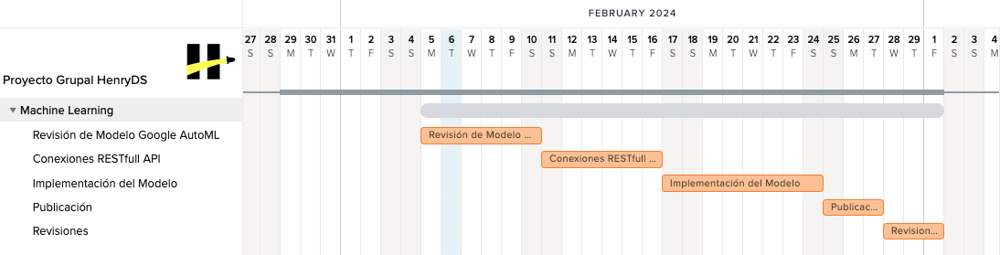

<p align="center">
    
</p>

# Proyecto de Machine Learning <!-- omit in toc -->

## Indice <!-- omit in toc -->

- [Descripción del Proyecto](#descripción-del-proyecto)
- [Flujo de Trabajo](#flujo-de-trabajo)
- [Objetivos Particulares](#objetivos-particulares)
- [Stack Tecnológico](#stack-tecnológico)
  - [Google Cloud Platform (GCP)](#google-cloud-platform-gcp)
  - [Vertex AI de Google](#vertex-ai-de-google)
    - [Bibliotecas y Funciones](#bibliotecas-y-funciones)
    - [Modelos](#modelos)
    - [Lenguajes](#lenguajes)
- [Requisitos de Instalación](#requisitos-de-instalación)
  - [Instalación](#instalación)
    - [Procedimiento](#procedimiento)
- [Resumen y Decisiones Finales](#resumen-y-decisiones-finales)
- [Contribuciones](#contribuciones)
- [Créditos](#créditos)
- [Licencias](#licencias)
- [Contacto](#contacto)
- [Enlaces adicionales](#enlaces-adicionales)

# Descripción del Proyecto

Este es un proyecto de Machine Learning que utiliza Vertex AI de Google para entrenar y desplegar modelos de aprendizaje automático y tiene como objetivo desplegarlos utilizando las bases de datos de Google y Yelp para hacer recomendaciones de hoteles.

# Flujo de Trabajo

Diagrama de Gantt
<p align="center">
    
</p>

# Objetivos Particulares

Seleccion del entorno de trabajo, biblioteca y modelo de machine learning, para luego implementarlo, entrenarlo, evaluarlo y validarlo, de manera que finalmente pueda ser desplegado y puesto en produccion, devolviendo recomendaciones de hoteles. 

# Stack Tecnológico

Conjunto de tecnologías, herramientas, frameworks e infraestructura que se utilizan para desarrollar y ejecutar el proyecto.

## Google Cloud Platform (GCP)
Utilizaremos Google Cloud Platform para acceder a los servicios de Vertex AI y alojar nuestro proyecto.
- Google Cloud Storage será utilizado para almacenar los datos raw.
- Google Cloud Filestore será utlizado por el ML para trabajar con los datos procesados. 

## Vertex AI de Google
Utilizaremos Vertex AI de Google para entrenar y desplegar nuestros modelos de aprendizaje automático.

### Bibliotecas y Funciones

Dentro de esta plataforma podremos utilizar las siguientes funciones y bibliotecas para implementar los modelos de recomendación:

  - **BigQuery ML**:
      BigQuery ML es una función dentro de Google BigQuery que permite a los usuarios crear y ejecutar modelos de aprendizaje automático directamente dentro del almacén de datos en la nube de BigQuery. Permite a los analistas y científicos de datos construir y desplegar modelos de machine learning usando SQL estándar, sin necesidad de mover datos a otro lugar. BigQuery ML admite varios tipos de modelos, como modelos de regresión, clasificación y clustering, y es adecuado para problemas de predicción y análisis de datos a gran escala.
  - **TensorFlow Recommenders**:
      TensorFlow Recommenders es una biblioteca de TensorFlow diseñada específicamente para construir y desplegar sistemas de recomendación utilizando modelos de aprendizaje profundo. Proporciona una variedad de algoritmos y herramientas que simplifican el proceso de construcción y entrenamiento de modelos de recomendación personalizados. TensorFlow Recommenders es especialmente útil para proyectos que requieren modelos avanzados de recomendación, como sistemas de recomendación de productos en línea, recomendaciones de contenido y sistemas de filtrado colaborativo.
  - **AI Platform de Google Cloud**:
      Google Cloud AI Platform es un servicio integral de Google Cloud diseñado para ayudar a las organizaciones a construir, entrenar, implementar y administrar modelos de machine learning a escala. Ofrece una variedad de servicios y herramientas que facilitan el desarrollo de modelos de machine learning, incluyendo TensorFlow, scikit-learn y otros frameworks populares. AI Platform proporciona capacidades de procesamiento escalable, administración de recursos, monitoreo de modelos y herramientas de colaboración para equipos de científicos de datos y desarrolladores de machine learning.
  - **Cloud Functions**:
      Google Cloud Functions es un servicio de computación sin servidor que permite a los desarrolladores ejecutar código en respuesta a eventos en la nube sin necesidad de aprovisionar o administrar servidores. Permite a los desarrolladores crear funciones pequeñas y modulares que se ejecutan de forma independiente en la nube, escalando automáticamente según la demanda. Cloud Functions es adecuado para implementar lógica empresarial, procesamiento de eventos, integraciones de sistemas y tareas de automatización en la nube de Google.

### Modelos

  - **Vecinos más cercanos (Nearest Neighbors)**:
      Este es un enfoque simple que recomienda elementos similares a los que un usuario ha interactuado anteriormente. Se basa en encontrar elementos similares en función de la distancia entre ellos en un espacio de características.
  - **Filtro colaborativo (Collaborative Filtering)**:
      Este enfoque recomienda elementos basados en la información de preferencias de otros usuarios. Puede ser basado en usuario (User-Based Collaborative Filtering) o basado en elemento (Item-Based Collaborative Filtering).
  - **Modelos de factorización matricial (Matrix Factorization Models)**:
      Estos modelos descomponen la matriz de interacciones usuario-elemento en matrices de características latentes para usuarios y elementos. Algunos ejemplos incluyen SVD (Descomposición de Valor Singular), Factorización QR, y Factorización de Matriz No Negativa (NMF).
  - **Modelos de factorización profunda (Deep Factorization Models)**:
      Estos modelos utilizan redes neuronales profundas para aprender representaciones latentes de usuarios y elementos, lo que puede mejorar la calidad de las recomendaciones. Ejemplos incluyen Autoencoders y Redes Neuronales Convolucionales (CNN) para recomendaciones de imágenes.
  - **Modelos de contenido (Content-Based Models)**:
      Estos modelos recomiendan elementos similares a los que un usuario ha interactuado anteriormente en función de características de los elementos, como metadatos o atributos. Utilizan técnicas de aprendizaje automático para calcular la similitud entre elementos.
  - **Modelos de aprendizaje por refuerzo (Reinforcement Learning Models)**:
      Estos modelos recomiendan elementos basados en interacciones de usuario en tiempo real y el objetivo de maximizar una recompensa a largo plazo. Pueden ser útiles en entornos donde las interacciones de los usuarios tienen un impacto dinámico en las recomendaciones.

### Lenguajes

- **Python**:
  - Utilizaremos Python como lenguaje de programación principal para desarrollar y ejecutar nuestro código.

- **Bibliotecas de Python**:
  - Las Bibliotecas de aprendizaje automático serán utilizadas según sea necesario para el desarrollo de modelos que se eligirán para trabajar con Vertex AI.

- **Entorno de Desarrollo**:
  - Visual Studio Code, Google Colab y Jupyter Notebook se utilizarán para escribir y ejecutar nuestro código Python.

- **Git y GitHub**:
  - Utilizaremos Git y GitHub para el control de versiones del código y la colaboración en equipo.

# Requisitos de Instalación

- Instalar Python: [Python.org](https://www.python.org/downloads/)
- Configurar Google Cloud Platform: [Google Cloud Platform](https://cloud.google.com/)
- Modelos y Paquetes a instalar:
  - Machine Learning: [Tensorflow Recommenders](https://blog.tensorflow.org/2020/09/introducing-tensorflow-recommenders.html?hl=es-419&_gl=1*1ywamkx*_ga*MTY2Nzg0ODg1Ni4xNzA3ODUyMzIw*_ga_W0YLR4190T*MTcwODY0NjkyOC40LjEuMTcwODY0NjkzNy4wLjAuMA)
  - Natural Language Processing: [Tensorflow Text](https://blog.tensorflow.org/2019/06/introducing-tftext.html?hl=es-419&_gl=1*qajqos*_ga*MTY2Nzg0ODg1Ni4xNzA3ODUyMzIw*_ga_W0YLR4190T*MTcwODY0NjkyOC40LjEuMTcwODY0NzA1OC4wLjAuMA..)


## Instalación

Asegurarse de tener Python instalado. Se recomienda usar un entorno virtual para instalar las dependencias del proyecto.

1. Clonar este repositorio en su máquina local.
2. Crear un entorno virtual para trabajar 
3. Instalar las dependencias necesarias utilizando el gestor de paquetes de su elección (por ejemplo, npm o pip).

### Procedimiento

```bash
git clone https://github.com/jgutierrezladino/HotelWise/tree/HotelWiseML

pip install -r requirements.txt

python /HotelWise/NLP.py

python /HotelWise/ML.py

```

# Resumen y Decisiones Finales

Recapitulando lo visto anteriormente, para abordar el problema específico en nuestro proyecto de Machine Learning, se ha optado por utilizar TensorFlow Recommenders con Vertex AI. Este enfoque nos permite automatizar el proceso de construcción y entrenamiento de modelos, optimizando y ajustando automáticamente los modelos según los datos de entrada y los objetivos del proyecto.
Además, se ha decidido implementar un modelo basado en similitud de coseno o el modelo de vecinos cercanos (near neighbors) y aquel que consuma menos recursos de CPU será el elegido. Este enfoque nos permite maximizar la eficiencia en entornos de costo elevado por uso de CPU, asegurando un rendimiento óptimo mientras gestionamos de manera efectiva los recursos disponibles.

---

# Contribuciones

¡Estamos abiertos a contribuciones! Si tienes ideas de mejora, problemas que reportar o características nuevas que te gustaría añadir, no dudes en abrir una solicitud de extracción o un problema en este repositorio.

# Créditos

- Desarrollado por HotelWise® 2024 Team.

- Logotipo diseñado por HotelWise® 2024 Copyright ©.

# Licencias

Este proyecto está bajo las Licencias:

- [](LICENSE-GPL)
- [](LICENSE-GPL)
- [](LICENSE-APACHE)


# Contacto

Si tienes alguna pregunta, comentario o problema con la página web de HotelWise, no dudes en ponerte en contacto con nosotros.

- **Delfina Longo Peña**
  -  [delfinapena55@gmail.com](mailto:delfinapena55@gmail.com)
  -  [Delfina Longo Peña](https://www.linkedin.com/in/delfina-longo-pe%C3%B1a-44b4b623b)
  -  [delfinap5](https://github.com/delfinap5)

- **Angel Prieto**
  -  [angelprieto92@gmail.com](mailto:angelprieto92@gmail.com)
  -  [Angel Prieto](https://www.linkedin.com/in/angelprieto92)
  -  [PrietoPy](https://github.com/PrietoPy)

- **Carlos Hidalgo**
  -  [hidalgo.carlos1984@gmail.com](mailto:hidalgo.carlos1984@gmail.com)
  -  [Carlos Hidalgo](https://www.linkedin.com/in/carlos-hidalgo84)
  -  [C-Hidalgo](https://github.com/C-Hidalgo)

- **Miguel Dallanegra**
  -  [mdallanegra@icloud.com](mailto:mdallanegra@icloud.com)
  -  [Miguel Dallanegra](https://www.linkedin.com/in/mdallanegra)
  -  [mdallanegra](https://github.com/mdallanegra)

# Enlaces adicionales

- [Documentación completa del proyecto](https://github.com/HotelWise/HotelWise)
- [Repositorio de código fuente de la Web](https://github.com/HotelWise/HotelWise/tree/HotelWiseML)
- [Sitio web en vivo](https://hotelwiseweb.uk.r.appspot.com)