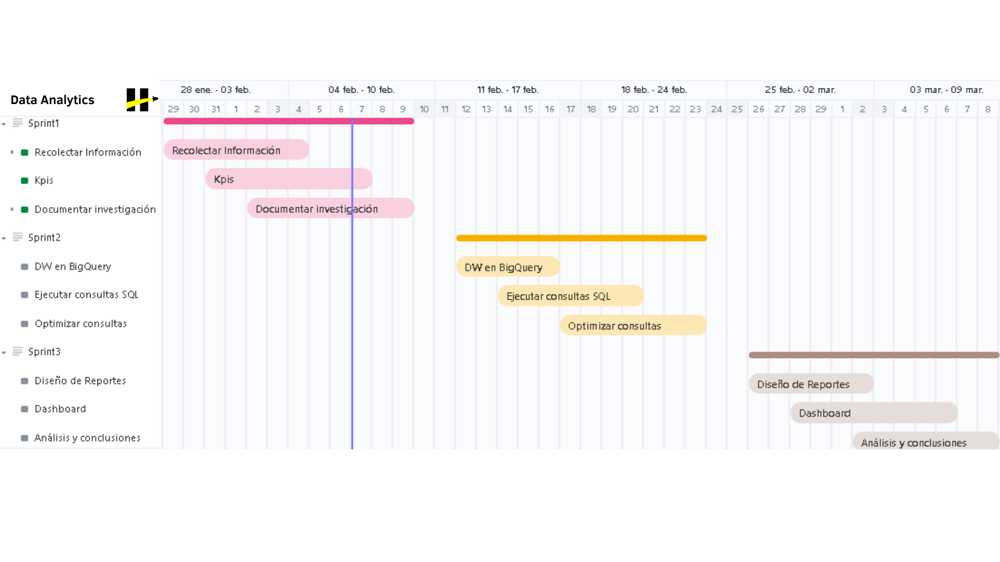
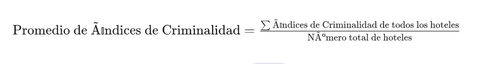
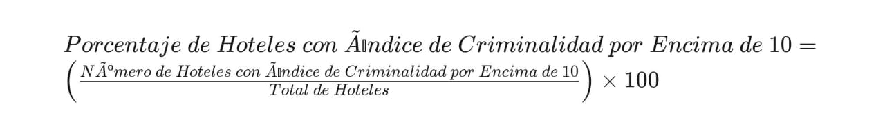
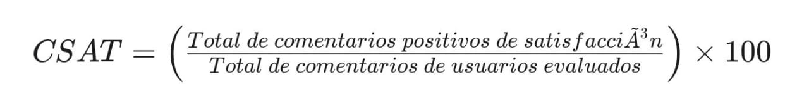

|

# **Data Analytics: HotelWise**

---

<strong>Índice</strong>

1. [Descripción del Producto](#Descripción-del-Producto)
2. [Flujo de trabajo](#Flujo-de-Trabajo)
3. [Componentes Principales](#Componentes-Principales)
4. [Objetivo SMART Sprint 1](#Objetivo-SMART-Sprint-1)
5. [Objetivo SMART Sprint 2](#Objetivo-SMART-Sprint-2)
6. [Objetivo SMART Sprint 3](#Objetivo-SMART-Sprint-3)
7. [KPIS](#KPIS)
   1. [Promedio de Índice de Criminalidad por Estado (PIDC)](#1.-Promedio-de-Índice-de-Criminalidad-por-Estado)
   2. [Porcentaje de Hoteles con Índice de Criminalidad por Encima de un Umbral (PHICEU)](#2.-Porcentaje-de-Hoteles-con-Índice-de-Criminalidad-por-Encima-de-un-Umbral-(PHICEU))
   3. [Tasa de Conversión de Reservas de acuerdo a las amenidades](#3.kpi-tasa-de-conversion)
   4. [Índice de Retención de Usuarios (RIU)](#4.kpi-riu)
   5. [Índice de Delitos por Área (IDA)](#5.kpi-ida)
8. [Stack Tecnológico](#stack-tecnologico)

## **Descripción del Producto**

---

En nuestro ámbito de Data Analytics, presentamremos productos enfocados en ofrecer análisis detallados y visualizaciones interactivas basadas en datos clave. Esto se logrará a través de un Data Warehouse en BigQuery, un Dashboard Interactivo en Looker Studio y análisis detallados que proporcionan una comprensión profunda de la información relevante. Estas herramientas permiten tomar decisiones estratégicas y fomentan la mejora continua en base a insights precisos.

## **Flujo de Trabajo**

---

El proyecto se divide en tres etapas denominadas "Sprints", cada una con una duración de dos semanas, lo que suma un total de 6 (seis) semanas para su ejecución completa.

## **Componentes Principales**

---

#### 1. Base de Datos en BigQuery

Almacén de datos limpio y organizado que incluye información detallada sobre preferencias de usuarios, comentarios, amenidades de hoteles y más.

#### 2. Dashboard Interactivo en Looker Studio

Panel visual interactivo que ofrece métricas clave, tendencias y análisis detallados para evaluar la satisfacción del usuario, la tasa de conversión de reservas y otros KPIs específicos.

#### 3. Análisis Detallados

Información específica y detallada sobre la preferencia de amenidades durante la temporada de verano, el índice de satisfacción del usuario, la tasa de conversión de reservas y otros KPIs relevantes.

## **Objetivo SMART Sprint 1**

---

### Objetivo Sprint 1

Las primeras 2 (dos) semanas, nos hemos enfocado en el desarrollo de KPIs con los datos necesarios, la organización efectiva de objetivos, la investigación de información de otras plataformas para destacarnos y la creación del README del proyecto.

### SMART Sprint 1

- **Específico (Specific):**

Hemos trabajado en el desarrollo de KPIs, la organización de objetivos, la investigación de información de otras plataformas y la creación del README en las últimas dos semanas.

- **Medible (Measurable):**

El progreso se ha medido por la finalización y organización efectiva de los KPIs, objetivos y el contenido del README.

- **Alcanzable (Achievable):**

La dedicación de tiempo y recursos a estas áreas ha sido alcanzable en un periodo de dos semanas.

- **Relevante (Relevant):**

El desarrollo de KPIs, la organización de objetivos y la investigación de otras plataformas son actividades relevantes para el éxito del proyecto.

- **Temporal (Time-bound):**

Estas actividades se han llevado a cabo en dos semanas, demostrando un progreso reciente y continuo.

#### Acciones Asociadas Sprint 1

1. Desarrollo de KPIs y Organización de Objetivos.
   - Identificamos y definimos KPIs clave.
   - Organizamos objetivos específicos para la fase de preparación de datos y creación de dashboard.

2. Investigación de Otras Plataformas.
   - Analizamos plataformas similares para obtener información relevante y diferenciarnos.

3. Creación del README.
   - Desarrollamos un README completo que destaca los aspectos clave del proyecto.

## **Objetivo SMART Sprint 2**

---

### Objetivo Sprint 2

Las siguientes 2 (dos) semanas, nos enfocamos en la preparación y organización efectiva de la base de datos en BigQuery.

### SMART Sprint 2

- **Específico (Specific):**

Dividimos el objetivo en la preparación de datos en BigQuery, centrándonos en la limpieza y organización de la base de datos.

- **Medible (Measurable):**

Medimos la calidad de la preparación de datos en BigQuery mediante la efectividad en la organización y limpieza de la base de datos.

- **Alcanzable (Achievable):**

Este objetivo fue alcanzable en dos semanas utilizando las herramientas y funciones de limpieza y organización de BigQuery.

- **Relevante (Relevant):**

La preparación de datos ha sido relevante para garantizar la solidez de la base de datos y la eficacia de las futuras visualizaciones en el dashboard.

- **Temporal (Time-bound):**

Nos comprometimos a completar la preparación de datos en BigQuery en dos semanas.

#### Acciones Asociadas Sprint 2

1. Mejora de la calidad de los datos:
   - Identificamos y corregimos posibles problemas relacionados con la calidad de los datos.
2. Organización:
   - Estructuramos la información en tablas y establecemos relaciones lógicas entre ellas.
3. Análisis:
   - Realizamos un análisis exploratorio inicial para detectar patrones y tendencias relevantes.

## **Objetivo SMART Sprint 3**

---

### Objetivo Sprint 3

Durante las últimas dos semanas, creamos un dashboard interactivo en Looker Studio que incluye análisis detallados y visualizaciones relevantes para respaldar la presentación del proyecto.

### SMART Sprint 3

- **Específico (Specific):**

Nos hemos enfocado en la creación de un dashboard en Looker Studio, priorizando la inclusión de análisis detallados y visualizaciones pertinentes.

- **Medible (Measurable):**

Evaluamos la creación del dashboard en Looker Studio según la inclusión de análisis detallados y visualizaciones relevantes para respaldar la presentación del proyecto.

- **Alcanzable (Achievable):**

Este objetivo fue factible en dos semanas utilizando la herramienta de creación visual de informes y dashboards que ofrece Looker Studio.

- **Relevante (Relevant):**

La creación del dashboard fue relevante para la presentación del proyecto, ya que impactará directamente en la percepción del comprador sobre la solidez y eficacia de la plataforma.

- **Temporal (Time-bound):**

Nos comprometimos a completar la creación del dashboard en Looker Studio en las últimas dos semanas.

#### Acciones Asociadas Sprint 3

1. Métricas: 
   - Seleccionamos las métricas clave a incluir en el dashboard.
2. Visualizaciones:
   - Diseñamos visualizaciones efectivas y comprensibles.
3. Análisis:
   - Integramos análisis detallados para respaldar puntos clave en la presentación del proyecto.

## **KPIS**

---

### 1. Promedio de Índice de Criminalidad por Estado (PIDC)

El Índice de Criminalidad por Estado o Región es una medida que proporciona información sobre el nivel de seguridad en diferentes áreas geográficas basadas en los hoteles de tu conjunto de datos.

#### Fórmula:

El PIDC se calcula de la siguiente forma:

#### Datos Necesarios:

1. **Índices de criminalidad en hoteles:** Representan los niveles de criminalidad registrados en cada hotel dentro de un estado o región específica. Estos índices incluyen diversos delitos como robos, asaltos y vandalismo, sirviendo como medida de seguridad en cada ubicación.
2. **Número de hoteles en el estado o región:** Indica la cantidad total de hoteles presentes en el área geográfica considerada, ya sea un estado o una región específica. Este dato es esencial para calcular el promedio de los índices de criminalidad, dividiendo la suma total de los índices entre el número de hoteles, obteniendo así el PIDC.

#### Objetivo Específico:

Evaluar el nivel de seguridad por estado o región utilizando los índices de criminalidad de los hoteles como medida.

#### Medición:

Calcula el promedio de los índices de criminalidad en los hoteles de cada estado o región, proporcionando una visión general del nivel de seguridad en áreas geográficas más amplias.

#### Resumen y Conclusiones:

El PIDC proporciona una visión general del nivel de seguridad en áreas geográficas más amplias, lo que ayuda a identificar áreas con posibles problemas de seguridad. Este KPI permite comparar la seguridad entre diferentes estados o regiones, lo que puede utilizarse para tomar decisiones informadas sobre ubicaciones específicas para los viajeros, implementar medidas de seguridad adicionales en áreas de mayor riesgo y mejorar la calidad del servicio en áreas donde la seguridad es una preocupación.

### 2. Porcentaje de Hoteles con Índice de Criminalidad por Encima de un Umbral (PHICEU)

El porcentaje de hoteles con un Índice de Criminalidad por Encima de un Umbral es una métrica importante para evaluar la seguridad y la percepción de seguridad de los hoteles en una determinada área. En este caso, el umbral se establece en 10, que representa el promedio de todos los índices de criminalidad.

#### Fórmula:
Para calcular el porcentaje de hoteles con un Índice de Criminalidad por Encima de un Umbral (umbral = 10), sigue esta fórmula:

#### Datos Necesarios:

1. **Índice de Criminalidad:** Este dato indica el nivel de criminalidad en el área donde se encuentra el hotel. Es esencial tener esta información para evaluar la seguridad del entorno.
2. **Umbral:** El umbral se establece en 10, que representa el promedio de todos los índices de criminalidad.
3. **Asociación con Hoteles:** Asocia cada índice de criminalidad con el hotel correspondiente para realizar un seguimiento y análisis precisos.

#### Objetivo Específico

Evaluar la seguridad y la percepción de seguridad de los hoteles en función de su índice de criminalidad, considerando un umbral de 10.

#### Medición

Calcular el porcentaje de hoteles cuyo índice de criminalidad está por encima del umbral establecido (10).

#### Resumen y Conclusiones

El porcentaje de hoteles con un Índice de Criminalidad por Encima de un Umbral (umbral = 10) proporciona información valiosa sobre la seguridad y la percepción de seguridad en el área donde se encuentran los hoteles. Este indicador puede ayudar a identificar áreas con mayores preocupaciones de seguridad y a tomar medidas para abordarlas y mejorar la seguridad general de los hoteles y sus entornos.

Al implementar esta métrica, podrás evaluar la seguridad de los hoteles y tomar decisiones informadas para mejorar la experiencia y la seguridad de tus huéspedes. Además, al establecer el umbral en 10, estás utilizando el promedio de todos los índices de criminalidad como referencia para determinar qué hoteles pueden requerir una atención especial en términos de seguridad.

### 3. Cantidad Promedio de Amenidades por Usuario en verano (CPAUV)

La Cantidad Promedio de Amenidades por Usuario en verano proporciona el promedio de la cantidad de amenidades preferidas por usuario durante la temporada de verano. Esta métrica ayuda a comprender mejor las preferencias de los usuarios durante ese período específico.

#### Fórmula:

La Cantidad Promedio de Amenidades por Usuario en verano se calcula como:

#### Datos necesarios:

1. **Total de amenidades preferidas durante el verano:** Es la suma del número de amenidades mencionadas en los comentarios positivos durante la temporada de verano.
2. **Total de usuarios que dejaron comentarios positivos sobre amenidades durante el verano:** Es la cantidad de usuarios que expresaron comentarios positivos relacionados con amenidades durante la temporada de verano.

#### Objetivo Específico:

Evaluar las preferencias de los usuarios en cuanto a las amenidades durante la temporada de verano.

#### Resumen y Conclusiones:

La Cantidad Promedio de Amenidades por Usuario en verano ofrece información valiosa sobre las preferencias de los usuarios durante la temporada de verano, lo que permite adaptar mejor los servicios ofrecidos a sus necesidades y expectativas durante ese período.

### 4. Índice de Satisfacción del Usuario (CSAT)

El Índice de Satisfacción del Usuario (CSAT) es una métrica crucial para evaluar la satisfacción general de los usuarios con un producto o servicio. En el contexto de tu plataforma, el CSAT se calculará utilizando los comentarios y reseñas de los usuarios sobre su experiencia con los hoteles durante la temporada de verano.

#### Fórmula:

El CSAT se calcula utilizando la siguiente fórmula:

#### Datos Necesarios:

1. **Comentarios de Usuarios:** Recopila comentarios de usuarios que contengan información sobre su satisfacción con el servicio. Estos comentarios deben estar asociados con cada usuario para calcular el CSAT por usuario.
2. **Análisis de Sentimiento:** Realiza un análisis de sentimiento en los comentarios para identificar aquellos que son positivos y están relacionados con la satisfacción del usuario. Esto permitirá filtrar los comentarios relevantes para el cálculo del CSAT.
3. **Temporada de Verano:** El período de evaluación para el CSAT será durante la temporada de verano, que abarca desde junio hasta agosto.
4. **Asociación con Usuarios:** Es esencial asociar cada comentario con el usuario correspondiente para calcular el CSAT por usuario.

#### Objetivo Específico:

Evaluar la satisfacción de los usuarios a través de comentarios de usuarios, recopilando puntuaciones de satisfacción.

#### Medición:

Recopilar puntuaciones de satisfacción a través de comentarios de los usuarios y calcular un índice de satisfacción del usuario (CSAT).

#### Resumen y Conclusiones:

El CSAT ofrece una medida clave de la satisfacción de los usuarios durante la temporada de verano, proporcionando información valiosa sobre la percepción general de los servicios ofrecidos y permitiendo mejoras continuas en la calidad del servicio.

Al implementar esta metodología, podrás evaluar de manera efectiva la satisfacción del usuario y realizar mejoras continuas en los servicios ofrecidos durante la temporada de verano.

### 5. Promedio de Calificaciones (AVG RATING)

El Promedio de Calificaciones (AVG RATING) es una métrica crucial para evaluar la satisfacción general de los usuarios con un producto o servicio. En el contexto de tu plataforma, el AVG_RATING se calcula utilizando las calificaciones dadas por los usuarios a los hoteles en tu conjunto de datos. Esta medida nos brinda información valiosa sobre la calidad percibida de los servicios ofrecidos.

#### Fórmula:

El AVG_RATING se calcula:

#### Datos Necesarios:

Calificaciones de Usuarios: Recopila las calificaciones dadas por los usuarios a los hoteles en tu conjunto de datos. Estas calificaciones deben estar asociadas con cada hotel para calcular el AVG_RATING por hotel.

#### Objetivo Específico:

Evaluar la satisfacción de los usuarios a través de las calificaciones proporcionadas a los hoteles en tu conjunto de datos.

#### Medición:

Calcular el promedio de las calificaciones dadas por los usuarios a los hoteles en tu conjunto de datos y obtener el AVG_RATING.

#### Resumen y Conclusiones:

El AVG_RATING ofrece una medida clave de la satisfacción de los usuarios con los hoteles en tu conjunto de datos, proporcionando información valiosa sobre la percepción general de los servicios ofrecidos y permitiendo mejoras continuas en la calidad del servicio.

## **Diccionario de datos**

---

## **Modelo de datos**

---

Optamos por un modelo relacional de tipo Estrella (Star) para nuestro conjunto de datos con el fin de mantener una estructura organizada y facilitar la recuperación y análisis de información. Este modelo es eficaz tanto para el análisis de datos como para su implementación en una base de datos, gracias a la claridad en las relaciones entre las tablas y la normalización de los datos. Esto nos permite realizar consultas complejas para obtener información detallada sobre hoteles, ubicaciones, opiniones y usuarios, lo cual es fundamental para el desarrollo de nuestra aplicación HotelWise.

### Relaciones

* Relación Uno a Uno (1:1) entre Hotel y Ubicación:

La relación se establece a través de la clave primaria en "Ubicación" (Url) y la clave foránea en "Hotel" (Url). Esto significa que cada hotel tiene una única ubicación, y cada ubicación pertenece a un solo hotel.

* Relación Uno a Muchos (1:N) entre Hotel y Review:

La relación se establece a través de la clave primaria en "Hotel" (Gmap_id) y la clave foránea en "Review" (Gmap_id). Un hotel puede tener múltiples revisiones, pero cada revisión está asociada a un solo hotel.

* Relación Uno a Muchos (1:N) entre Review y Usuario:

La relación se establece a través de la clave primaria en "Usuario" (User_id) y la clave foránea en "Review" (User_id). Un usuario puede tener múltiples revisiones, pero cada revisión está asociada a un solo usuario.

## **Dashboard**

---

Link de acceso: [Dashboard](https://lookerstudio.google.com/reporting/b6c70dbb-9c99-4710-8eb3-03f883cf818a)

## **Stack Tecnológico**

---

En este proyecto, se emplearán las siguientes tecnologías para la gestión y análisis de datos:

#### **Google Colaboratory**

- *Descripción:* Google Colaboratory, es una plataforma en línea que nos permite escribir y ejecutar código en Python directamente en el navegador. Proporciona acceso gratuito a recursos informáticos, incluidas GPU, lo que lo hace ideal para el análisis de datos.

- *Utilidad:* Los utilizamos para desarrollar y ejecutar código de Python de manera colaborativa, facilitando la creación de documentos interactivos que combinan código, texto explicativo y visualizaciones, tambien para modificar los datos y actualizarlos en BigQuery.

#### **BigQuery**

- *Descripción:* BigQuery es un almacén de datos completamente administrado y altamente escalable que permite analizar grandes conjuntos de datos en tiempo real mediante SQL.

- *Utilidad:* Almacena y procesa grandes volúmenes de datos de manera eficiente, lo que nos permite realizar análisis de datos complejos y consultas en tiempo real. Se conecta y envia los datos actualizados facilmente a Looker Studio.

#### **Looker Studio**

- *Descripción:* Looker Studio es una plataforma de análisis de datos que proporciona herramientas poderosas para explorar y visualizar datos, crear paneles interactivos y compartir conocimientos.

- *Utilidad:* Integraremos Looker Studio para crear visualizaciones dinámicas, paneles interactivos, campos calculados, filtros, Kpis y asi generr un reporte personalizado basado en los datos almacenados en BigQuery.

### *Tecnologías adicionales*

#### **ClickUp**

- *Descripción:* ClickUp es una plataforma de gestión de proyectos y tareas que ofrece herramientas para la planificación, seguimiento y colaboración en equipos.

- *Utilidad:* Integraremos ClickUp para organizar tareas, asignar responsabilidades y mantener un seguimiento del progreso del proyecto. Con sus características de colaboración y seguimiento de tiempo, ClickUp facilitará la gestión eficiente del proyecto y la coordinación del equipo.

#### **Lucidchart**

- *Descripción:* Lucidchart es una plataforma en línea que permite crear diagramas, flujos de trabajo y otros tipos de representaciones visuales de manera colaborativa. Proporciona una interfaz intuitiva para la creación y edición de diagramas, facilitando la comunicación visual en equipos de trabajo. Además, al ser una plataforma en línea, permite la colaboración en tiempo real entre múltiples usuarios, lo que facilita el trabajo en equipo.

- *Utilidad:* Con esta app creamos el modelo ER facilmente. Es una herramienta valiosa para la comunicación de ideas de manera clara y eficiente.

#### *Integración de Tecnologías*

- **Complementariedad:** La integración de las tecnologías utilizadas ofrece una solución completa para el almacenamiento, procesamiento, análisis, visualización y gestión de proyectos de datos. Esta combinación nos proporciona las herramientas necesarias para obtener información significativa a partir de nuestros datos, tomar decisiones informadas y gestionar eficazmente el proyecto.

- **Escalabilidad:** Todas las tecnologías seleccionadas son altamente escalables y pueden adaptarse a las necesidades cambiantes del proyecto a medida que crece y se desarrolla.

## Contacto

---
**Delfina Peña**
- Gmail: delfinapena55@gmail.com
- LinkedIn: [Delfina Longo Peña](www.linkedin.com/in/delfina-longo-peña-44b4b623b)
- Github: [delfinap5](https://github.com/delfinap5)

**Carlos Hidalgo**
- Gmail: hidalgo.carlos1984@gmail.com
- LinkedIn: [Carlos Hidalgo](https://www.linkedin.com/in/carlos-hidalgo84)
- Github: [C-Hidalgo](https://github.com/C-Hidalgo)
